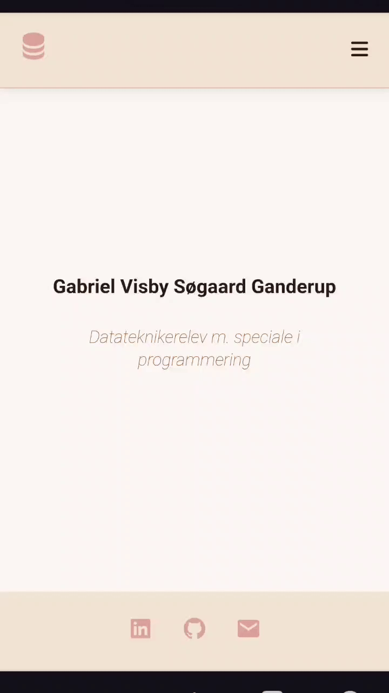

# Portfolio Website Template

A clean, responsive portfolio website template built with HTML, CSS, and JavaScript.

## Live Demo
🔗 [View Live Website](https://gaga01.skp-dp.sde.dk/)

## Preview
### Desktop View

*Desktop navigation and features demonstration*

### Mobile View

<br>*Mobile responsiveness and navigation demonstration*

## Features
- Responsive design that works on both desktop and mobile
- Smooth section transitions
- Interactive timeline for experience
- Skills showcase with icons
- Project showcase
- Social media links
- Dark/light mode support

## Getting Started

1. Clone this repository
2. Replace placeholder content with your own:
   - Update `[Your Name]` and other placeholders in `index.html`
   - Replace `your-photo.jpg` with your own image
   - Update social media links in the footer
   - Add your own projects and experiences
   - Customize colors in `style.css` and `mobilestyle.css`
   - Update Font Awesome kit code in `index.html`

## Customization

### Colors
Edit the root variables in `style.css` and `mobilestyle.css`:
```css
:root {
    --main-bg: #YOUR-COLOR;
    --secondary-bg: #YOUR-COLOR;
    --accent: #YOUR-COLOR;
    --accent-dark: #YOUR-COLOR;
    --link: #YOUR-COLOR;
    --text-dark: #YOUR-COLOR;
}
```

### Sections
1. Add/remove sections in `index.html`
2. Update navigation links in the header
3. Add corresponding section styles in CSS files

### Icons
This template uses:
- Font Awesome
- Boxicons

Replace or add icons as needed using these libraries.

## Structure
```
portfolio-website/
├── assets/
│   ├── images/
│   ├── scripts/
│   │   ├── script.js
│   │   └── timeline.js
│   └── stylesheets/
│       ├── style.css
│       └── mobilestyle.css
├── index.html
└── README.md
```

## Credits
Original template by Gabriel Visby Søgaard Ganderup
Feel free to use and modify for your own portfolio!
